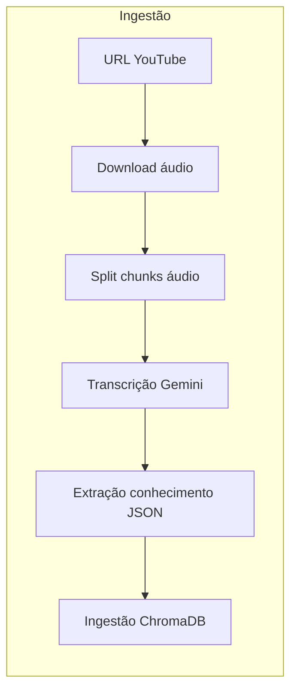
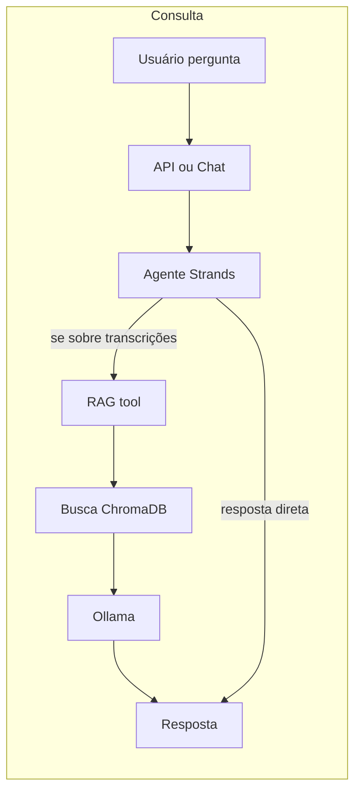

# O Cronista Arcano — Documentação do Projeto

Documentação técnica para onboarding de novos desenvolvedores. Descreve arquitetura, módulos, fluxos de código, tecnologias e comandos de execução.

---

## 1. Visão geral e propósito

**O Cronista Arcano** é um sistema de **RAG (Retrieval-Augmented Generation)** voltado a mestres de RPG. O fluxo principal é:

1. **Ingestão**: URLs de vídeos do YouTube (sessões/playlists) são processadas: o áudio é baixado, dividido em trechos, transcrito via Google Gemini e opcionalmente passa por extração de conhecimento (JSON). O texto final é ingerido em um banco vetorial (ChromaDB) com chunking e embeddings.
2. **Consulta**: O usuário faz perguntas em linguagem natural; um agente (Strands) decide se responde direto ou invoca a ferramenta de consulta às transcrições. Quando a tool é usada, o sistema faz busca semântica no ChromaDB, monta um contexto e gera a resposta com um LLM local (Ollama).

**Público-alvo desta documentação**: desenvolvedores que precisam entender o projeto de forma profunda sem ler todo o código-fonte.

---

## 2. Arquitetura de alto nível

O sistema está organizado em camadas: **config**, **extraction**, **memory**, **rag**, **agent**, **api**, **web** e **prompts**.

### 2.1 Fluxo de ingestão



- **URL YouTube** → **Download** (yt-dlp, MP3) → **Split em chunks de áudio** (pydub, duração fixa) → **Transcrição** (Gemini por chunk, merge em `full_transcript.txt`) → **Extração de conhecimento** (Gemini + prompt mestre → JSON) → **Ingestão no ChromaDB** (chunking de texto com LangChain, resumo opcional por chunk via Ollama, embeddings sentence-transformers, persistência em disco).

### 2.2 Fluxo de consulta



- **Usuário** envia pergunta (via API ou chat CLI). A **API** chama o **agente Strands**, que pode responder diretamente (saudações, perguntas gerais) ou invocar a **tool RAG** (`consultar_transcricoes`). A tool executa **busca semântica** no ChromaDB (com filtro opcional por `video_id`), formata o contexto e chama o **Ollama** para gerar a **resposta**.

---

## 3. Estrutura de diretórios

```
o-cronista-arcano/
├── config/                 # Configuração e paths
│   ├── settings.py         # Constantes (dirs, modelos, chunk sizes, etc.)
│   ├── helper.py           # PROJECT_ROOT, funções de path, setup_directories
│   └── __init__.py
├── src/
│   ├── extraction/         # Pipeline YouTube → transcrição → JSON
│   │   ├── run_pipeline.py # Orquestração do pipeline (CLI)
│   │   ├── ingestion.py    # Download de áudio (yt-dlp)
│   │   ├── audio_processor.py  # Divisão do áudio em chunks (pydub)
│   │   ├── transcription.py    # Transcrição por chunk (Gemini)
│   │   ├── knowledge_extraction.py  # Extração de conhecimento (Gemini)
│   │   └── io_utils.py     # Leitura/escrita de arquivos de texto
│   ├── memory/             # Chunking, embeddings, ChromaDB, ingestão, busca
│   │   ├── text_chunker.py # Divisão de texto em chunks (LangChain)
│   │   ├── embeddings.py  # Sentence-transformers + ChromaDB embedding function
│   │   ├── chunk_summary.py   # Resumo de chunk via Ollama (metadado)
│   │   ├── vector_store.py # Cliente ChromaDB, collection, add/query
│   │   ├── ingest.py      # Ingestão de full_transcript.txt no ChromaDB
│   │   ├── search.py      # Busca semântica e search_by_video
│   │   └── chat.py        # Chat RAG interativo (CLI)
│   ├── rag/                # Pipeline RAG e tool para o agente
│   │   ├── models.py      # RAGSource, RAGResult (Pydantic)
│   │   ├── pipeline.py    # rag_query: busca → contexto → Ollama
│   │   └── tools.py       # Tool Strands consultar_transcricoes
│   ├── agent/              # Runner do agente Strands
│   │   └── runner.py      # agent_query, AgentResult
│   ├── api/                # FastAPI e endpoints HTTP
│   │   └── main.py        # App FastAPI, /videos, /processar, /perguntar, static
│   └── prompts/            # Arquivos de prompt
│       ├── agent_system.txt      # System prompt do agente
│       ├── master_prompt.txt     # Prompt para extração de conhecimento
│       └── transcription_prompt.txt  # Prompt para transcrição
├── web/                    # Frontend estático (HTML/CSS/JS)
│   ├── index.html
│   ├── css/style.css
│   └── js/app.js
├── tests/                  # Testes pytest
├── downloads/              # Dados em tempo de execução (não versionar)
│   ├── audio/              # Áudio MP3 baixado
│   ├── chunks/             # Chunks de áudio por vídeo
│   ├── transcripts/        # Transcrições por vídeo (full_transcript.txt)
│   ├── json/               # JSON de extração de conhecimento
│   └── vectordb/           # Persistência do ChromaDB
├── pyproject.toml
├── uv.lock
└── README.md
```

| Pasta | Descrição |
|-------|-----------|
| `config/` | Constantes e funções de path usadas em todo o projeto. |
| `src/extraction/` | Pipeline de mídia e texto: YouTube → áudio → chunks → transcrição → JSON. |
| `src/memory/` | Chunking de texto, embeddings, ChromaDB, ingestão e busca semântica. |
| `src/rag/` | Pipeline RAG (busca + LLM) e tool exposta ao agente. |
| `src/agent/` | Agente Strands que usa a tool RAG quando necessário. |
| `src/api/` | API HTTP FastAPI e servir da interface web. |
| `src/prompts/` | Textos de prompt para agente, extração e transcrição. |
| `web/` | Interface estática (grimórios = vídeos, chat por vídeo, transmutar vídeo). |
| `tests/` | Testes pytest; marker `slow` para testes com Ollama/ingest. |
| `downloads/` | Áudio, chunks, transcripts, json e vectordb gerados em execução. |

---

## 4. Módulos e funções

### 4.1 config

| Arquivo | Conteúdo |
|---------|----------|
| **config/settings.py** | Constantes: nomes de diretórios (`DOWNLOADS_DIR_NAME`, `AUDIO_DIR_NAME`, `CHUNKS_DIR_NAME`, `TRANSCRIPTS_DIR_NAME`, `JSON_DIR_NAME`, `VECTOR_DB_DIR_NAME`), nomes de arquivos (`FULL_TRANSCRIPT_FILENAME`, `TRANSCRIPT_CHUNK_SUFFIX`, etc.), modelo Gemini (`MODEL_NAME`), modelo agente Ollama (`AGENT_MODEL`), duração de chunk de áudio (`DEFAULT_AUDIO_CHUNK_MINUTES`, `DEFAULT_AUDIO_CHUNK_LENGTH_MS`), chunking de texto (`CHUNK_SIZE`, `CHUNK_OVERLAP` em tokens), `EMBEDDING_MODEL`, Chroma (`CHROMA_COLLECTION_NAME`, `CHROMA_ADD_BATCH_SIZE`), RAG (`RAG_TOP_K_DEFAULT`), busca (`SEARCH_DEFAULT_TOP_K`, `SEARCH_PREVIEW_MAX_CHARS`). |
| **config/helper.py** | `PROJECT_ROOT`, `DOWNLOADS_DIR`, `AUDIO_DIR`, etc.; `get_audio_dir()`, `get_episode_chunks_dir(video_id)`, `get_episode_transcripts_dir(video_id)`, `get_final_transcript_path(video_id)`, `get_knowledge_extraction_path(video_id)`, `get_vector_db_dir()`, `get_master_prompt_path()`, `get_transcription_prompt_path()`, `read_master_prompt()`, `setup_directories()`. |

### 4.2 src/extraction

| Arquivo | Funções / responsabilidade |
|---------|----------------------------|
| **run_pipeline.py** | `run_pipeline(video_url)` — valida `GEMINI_API_KEY`, chama `setup_directories()`, executa as 4 etapas (download, split áudio, transcrição, extração de conhecimento) e retorna `ProcessingResult`. `PipelineContext` guarda estado entre etapas; `_failure_result()` monta resultado de falha. CLI: `argparse` com URL obrigatória e `-v` (verbose). |
| **ingestion.py** | `download_audio(video_url, output_dir)` — usa yt-dlp para baixar o melhor áudio e converter para MP3; retorna caminho do arquivo ou `None`. |
| **audio_processor.py** | `split_audio_into_chunks(audio_file_path, output_dir, chunk_length_ms)` — carrega áudio com pydub, divide em trechos de duração fixa (config), salva como MP3 e retorna lista de caminhos. |
| **transcription.py** | `transcribe_audio_gemini(audio_file_path, model)` — upload do áudio para a API Gemini e geração de transcrição. `process_episode_transcription(video_id)` — lista chunks MP3 do episódio, transcreve cada um (com cache por arquivo), concatena em `full_transcript.txt` e retorna o path. |
| **knowledge_extraction.py** | `knowledge_extract(transcription_text, query_prompt)` — envia transcrição + prompt mestre ao Gemini e retorna o texto da resposta. `clean_and_validate_json(raw_text)` — remove markdown de código se existir, valida JSON e retorna `(texto_limpo, is_valid)`. |
| **io_utils.py** | `read_text_file(file_path)` — lê conteúdo UTF-8; retorna `None` em erro. `save_text_to_file(text, file_path)` — grava UTF-8; retorna `True`/`False`. |

### 4.3 src/memory

| Arquivo | Funções / responsabilidade |
|---------|----------------------------|
| **text_chunker.py** | `split_text(text, chunk_size, chunk_overlap)` — usa LangChain `RecursiveCharacterTextSplitter` com `length_function` em **tokens** (tokenizer do `EMBEDDING_MODEL`). Retorna lista de `TextChunk` (content, index). |
| **embeddings.py** | `get_embedding_model()` — carrega/cacheia SentenceTransformer. `generate_embeddings(texts)` — embeddings para documentos. `embed_for_query(texts)` — embeddings para consulta (prefixo `"query: "` em modelos E5). `SentenceTransformerEmbeddingFunction` — implementação ChromaDB com prefixos passage/query para E5. |
| **chunk_summary.py** | `generate_chunk_summary(text)` — chama Ollama (modelo do agente) para gerar resumo denso em 1–2 frases; em falha retorna truncamento do texto. Usado como metadado na ingestão. |
| **vector_store.py** | `get_chroma_client()` — cliente ChromaDB persistente (cache). `get_or_create_collection(collection_name)` — collection com embedding function. `add_documents(documents, metadatas, ids)` — insere em lotes. `query_collection(query_text, n_results, where)` — busca por embedding. `list_video_ids()` — lista de `video_id` na collection. `get_collection_info()`, `delete_collection()`. |
| **ingest.py** | `find_transcripts()` — glob de `*/full_transcript.txt` no dir de transcrições. `extract_video_id_from_path(transcript_path)` — nome da pasta pai. `ingest_transcript(transcript_path)` — lê arquivo, `split_text`, gera resumo por chunk (`generate_chunk_summary`), monta metadados e IDs, chama `add_documents`; retorna `IngestResult`. `ingest_all_transcripts(force)` — processa todos os transcripts; pula já ingeridos se `force=False`. `check_if_already_ingested(video_id)`. CLI: `--force` para reingerir. |
| **search.py** | `semantic_search(query, top_k, where)` — delega a `query_collection` e converte em lista de `SearchResult`. `search_by_video(query, video_id, top_k)` — busca com filtro `where={"video_id": video_id}`. `SearchResult` — content, video_id, source_file, chunk_index, distance, relevance_score. `format_results()`, `interactive_search()`. CLI: query opcional, `-n`, `-v/--video`. |
| **chat.py** | `chat_with_context(question, model, top_k, video_id)` — chama `rag_query` e retorna a resposta. `interactive_chat(model)` — loop de input no terminal. CLI: `-m/--model`, `-q/--question` (pergunta única). |

### 4.4 src/rag

| Arquivo | Funções / responsabilidade |
|---------|----------------------------|
| **models.py** | `RAGSource` — video_id, content, chunk_index, relevance_score. `RAGResult` — answer, sources (lista de RAGSource). Pydantic. |
| **pipeline.py** | `rag_query(question, video_id, top_k, model)` — se `video_id` usa `search_by_video`, senão `semantic_search`; formata contexto; monta prompt com template; chama `ollama.chat`; retorna `RAGResult` com resposta e fontes. |
| **tools.py** | Tool Strands `consultar_transcricoes(question, video_id=None, tool_context=None)` — obtém `video_id` do parâmetro ou de `tool_context.invocation_state`; chama `rag_query`; formata resposta em texto com "Fontes: ..." para o LLM. |

### 4.5 src/agent

| Arquivo | Funções / responsabilidade |
|---------|----------------------------|
| **runner.py** | `agent_query(pergunta, video_id, model)` — carrega system prompt de `prompts/agent_system.txt` (ou padrão); adiciona contexto de `video_id` se informado; cria Agent Strands com Ollama e tool `consultar_transcricoes`; executa; extrai texto da resposta (ignorando JSON de tool call) e detecta `used_rag`/`sources` a partir do estado; retorna `AgentResult(answer, used_rag, sources)`. |

### 4.6 src/api

| Arquivo | Funções / responsabilidade |
|---------|----------------------------|
| **main.py** | App FastAPI com CORS aberto; monta arquivos estáticos da pasta `web/` em `/static`; rotas explícitas para `/js/app.js` e `/css/style.css`. `GET /` — serve `index.html` ou mensagem. `GET /videos` — lista `video_id` do ChromaDB. `POST /processar` — body `{ "url": "..." }`; chama `run_pipeline` e depois `ingest_transcript` em thread; retorna `video_id` e `chunks_ingeridos`. `POST /perguntar` — body `{ "video_id", "pergunta" }`; chama `agent_query` em thread; retorna `resposta`, `used_rag`, `sources`. Pipeline e ingestão via `asyncio.to_thread`. |

### 4.7 src/prompts

| Arquivo | Uso |
|---------|-----|
| **agent_system.txt** | System prompt do agente Strands: papel do Cronista Arcano e quando usar a ferramenta de consulta às transcrições. |
| **master_prompt.txt** | Prompt para a etapa de extração de conhecimento (Gemini): instruções para produzir o JSON a partir da transcrição. |
| **transcription_prompt.txt** | Prompt enviado ao Gemini junto com o áudio para transcrição. |

### 4.8 web

Interface estática (HTML/CSS/JS puro, sem build):

- **GET /videos** — carrega lista de “grimórios” (vídeos) na barra lateral.
- Seleção de um vídeo — habilita o chat e define `video_id` nas perguntas.
- **POST /perguntar** — envia `video_id` e `pergunta`; exibe a resposta do agente.
- Modal “Transmutar Novo Vídeo” — **POST /processar** com URL do YouTube; ao sucesso, atualiza lista e pode selecionar o novo vídeo.

---

## 5. Fluxos de código resumidos

### Processar vídeo (API)

1. Cliente envia `POST /processar` com `{ "url": "https://..." }`.
2. API chama `config.setup_directories()` e `run_pipeline(url)` em thread (download → split → transcribe → knowledge).
3. Com `ProcessingResult` de sucesso, obtém `get_final_transcript_path(result.video_id)` e chama `ingest_transcript(transcript_path)` em thread (ler → `split_text` → resumos por chunk → `add_documents`).
4. Resposta: `{ "success": true, "video_id": "...", "chunks_ingeridos": N }`.

### Perguntar (API)

1. Cliente envia `POST /perguntar` com `{ "video_id": "...", "pergunta": "..." }`.
2. API chama `agent_query(pergunta, video_id)` em thread.
3. Agente Strands processa; se decidir usar a tool, chama `consultar_transcricoes` → `rag_query` → `semantic_search` ou `search_by_video` → formata contexto → Ollama → resposta.
4. API extrai da resposta do agente o texto final e os metadados de uso da RAG e retorna `{ "resposta", "used_rag", "sources" }`.

---

## 6. Tecnologias e bibliotecas

| Categoria | Tecnologia |
|-----------|------------|
| Linguagem | Python 3.12 |
| Backend/API | FastAPI, Uvicorn |
| Banco vetorial | ChromaDB (persistente em disco), sentence-transformers (`intfloat/multilingual-e5-large`), LangChain text splitters, tokenizer Hugging Face para tamanho em tokens |
| LLM nuvem | Google Gemini (`google-genai`) — transcrição de áudio e extração de conhecimento; variável `GEMINI_API_KEY` em `.env` |
| LLM local | Ollama — agente (Strands), conclusão RAG, resumo de chunks; modelos: agente `granite4:3b-h`, RAG `gemma3:4b` |
| Agente | Strands (`strands-agents[ollama]`) — Agent com tool `consultar_transcricoes` |
| Mídia | yt-dlp (download de áudio), pydub (corte de áudio em chunks) |
| Outros | pydantic, python-dotenv |
| Testes | pytest; marker `slow` para testes que dependem de Ollama ou ingest completo |

Dependências principais em `pyproject.toml`: chromadb, fastapi, google-genai, langchain-text-splitters, ollama, pydub, python-dotenv, sentence-transformers, strands-agents[ollama], uvicorn[standard], yt-dlp. Dev: pytest.

---

## 7. Configuração e ambiente

- **Constantes**: definidas em `config/settings.py` (sem leitura de variáveis de ambiente).
- **Paths**: construídos em `config/helper.py` a partir de `PROJECT_ROOT` e nomes em settings.
- **Variáveis de ambiente**: `.env` com `GEMINI_API_KEY` (obrigatório para o pipeline de extração e transcrição).
- **Ollama**: deve estar rodando em `http://localhost:11434`; modelos usados (ex.: `granite4:3b-h`, `gemma3:4b`) precisam estar instalados.

---

## 8. Comandos para rodar o projeto

| Ação | Comando |
|------|---------|
| Instalar dependências | `uv sync` ou `pip install -e .` |
| Subir a API | `python src/api/main.py` ou `uvicorn src.api.main:app --reload --host 0.0.0.0 --port 8000` |
| Processar um vídeo (CLI) | `python src/extraction/run_pipeline.py "https://www.youtube.com/watch?v=..."` (opcional: `-v`) |
| Ingerir todos os transcripts | `python -m src.memory.ingest` (opcional: `--force` para reingerir) |
| Chat RAG interativo | `python -m src.memory.chat` (opcional: `--model MODEL`, `--question "pergunta"`) |
| Busca semântica | `python -m src.memory.search "sua pergunta"` (opcional: `-n N`, `-v/--video ID`); sem argumentos abre modo interativo |
| Rodar testes | `pytest tests/` (excluir slow: `pytest -m 'not slow' tests/`) |
| Ver paths do projeto | `python config/helper.py` |

---

## 9. Testes

- **Localização**: pasta `tests/`.
- **Exemplos**: `test_ingestion.py`, `test_ingest_chunk_summary.py`.
- **Marker `slow`**: marca testes que dependem de Ollama ou de ingest completo; para rodar só testes rápidos: `pytest -m 'not slow' tests/`.
- **Configuração**: `pyproject.toml` define `pythonpath = ["."]`, `testpaths = ["tests"]` e o marker `slow`.

---

## 10. Observações para desenvolvedores

- **Alterar tamanhos de chunk, top_k, modelos**: use `config/settings.py` (CHUNK_SIZE, CHUNK_OVERLAP, DEFAULT_AUDIO_CHUNK_MINUTES, RAG_TOP_K_DEFAULT, SEARCH_DEFAULT_TOP_K, MODEL_NAME, AGENT_MODEL, EMBEDDING_MODEL, etc.).
- **Alterar prompts**: edite os arquivos em `src/prompts/` (agent_system.txt, master_prompt.txt, transcription_prompt.txt).
- **Dados persistentes**: tudo em `downloads/` (audio, chunks, transcripts, json, vectordb); não versionar; pode ser recriado rodando o pipeline e a ingestão.
- **API assíncrona**: o FastAPI chama `run_pipeline` e `ingest_transcript` via `asyncio.to_thread` para não bloquear o event loop durante o processamento síncrono.
